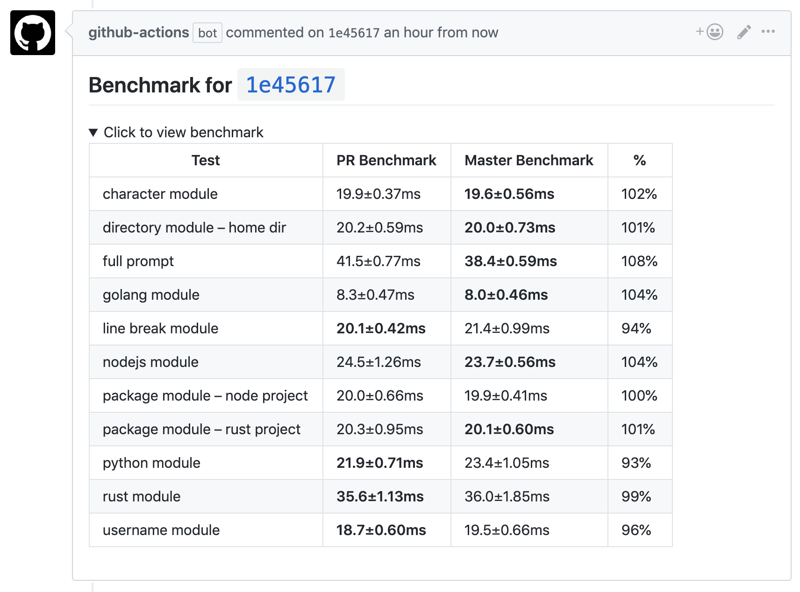

# criterion-compare

Compare the performance of a PR against the base branch.

---

> ⚠️ Performance benchmarks provided by this action may fluctuate as load on GitHub Actions does. Run benchmarks locally before making any decisions based on the results.

A GitHub action that will compare the benchmark output between a PR and the base branch, using the project's [criterion.rs](https://github.com/bheisler/criterion.rs/) benchmarks.

## Example



## Usage

Create a `.github/workflows/pull_request.yml` file in your repo:

```yml
on: [pull_request]
name: benchmark pull requests
jobs:
  runBenchmark:
    name: run benchmark
    runs-on: ubuntu-latest
    steps:
      - uses: actions/checkout@master
      - uses: boa-dev/criterion-compare-action@v3.0.0
        with:
          cwd: "subDirectory (optional)"
          # Optional. Compare only this benchmark target
          benchName: "example-bench-target"
          # Optional. Disables the default features of a crate
          defaultFeatures: false
          # Optional. Features activated in the benchmark
          features: "async,tokio-support"
          # Needed. The name of the branch to compare with. This default uses the branch which is being pulled against
          branchName: ${{ github.base_ref }}
          # Optional. Default is `${{ github.token }}`.
          token: ${{ secrets.GITHUB_TOKEN }}
```

## Troubleshooting

### `Unrecognized option: 'save-baseline'`

If you encounter this error, you can check [this Criterion FAQ](https://bheisler.github.io/criterion.rs/book/faq.html#cargo-bench-gives-unrecognized-option-errors-for-valid-command-line-options), to find a workaround.
